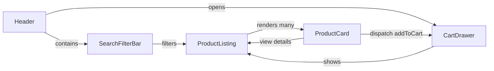
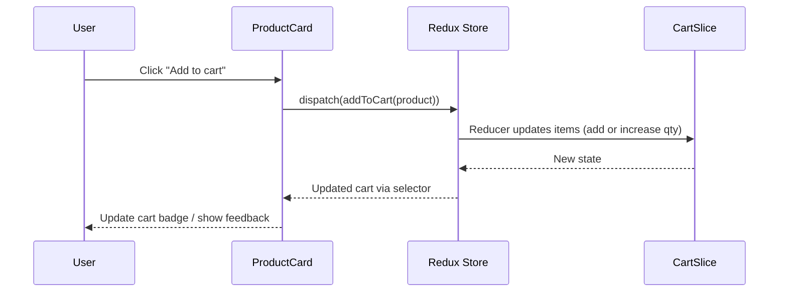

## retail-ui — React + Vite (Retail UI)

This repository is a small e-commerce / product listing UI built with React and Vite. It demonstrates a pragmatic approach for building a responsive, themeable component-driven UI with predictable client state.

## Quick start

Install dependencies and run the dev server:

```bash
npm install
npm run dev
```

Build for production:

```bash
npm run build
npm run preview
```

## Approach

- Composition-first components: small, focused components that compose into pages (e.g. `ProductCard` + `SearchFilterBar` -> `ProductListing`).
- Single source of truth for global state using Redux Toolkit. Local UI state is kept in component state or the `uiSlice` when shared.
- Data fetching via Redux Toolkit Query (`src/store/apiSlice.js`) for caching, deduping, and easy loading/error handling.
- Theming and visual tokens centralized in `src/theme/theme.js` (based on MUI `createTheme`) so components follow a consistent design system.
- Performance: lightweight components, memoization where helpful, and a debounced search hook (`src/hooks/useDebounce.js`) to reduce re-renders and requests.

Contract (high level):
- Inputs: product list from API, user interactions (search, add to cart, filter)
- Outputs: UI states (list, cart contents), dispatched Redux actions
- Success: responsive UI, consistent theming, simple cart operations
- Error modes: network errors surfaced from RTK Query, empty states displayed to the user

Edge cases considered: empty product lists, slow network, duplicate add-to-cart actions, and theme switching (light/dark).

## Design system used

- Primary system: Material UI (MUI) with `@mui/material` + `@mui/icons-material`.
- Styling: `@emotion/react` and `@emotion/styled` (used by MUI in this project).
- Theme tokens are defined in `src/theme/theme.js` and include:
	- Spacing system (8px grid via `spacing`)
	- Palette with `primary`, `secondary`, `background`, and `text`
	- Shape tokens (`borderRadius`)
	- Typography tokens (font family, heading/body styles)
	- Component-level overrides for MUI (Card, Button, TextField, Select) to keep consistency.

Why this choice?
- MUI provides accessible, well-tested components and accelerates building a consistent UI.
- The custom `getTheme` wrapper allows enforced tokens and easy light/dark support while keeping MUI APIs.

## Component structure

Top-level folders and purpose:

- `src/components/` — reusable UI components
	- `Header.jsx` — top navigation, search entry, cart icon and theme toggle
	- `ProductCard.jsx` — product thumbnail, title, price, add-to-cart control
	- `SearchFilterBar.jsx` — search input and filter controls (uses `useDebounce`)
	- `CartDrawer.jsx` — slide-over drawer showing cart items and checkout actions

- `src/pages/`
	- `ProductListing.jsx` — page assembling `SearchFilterBar` + product grid

- `src/context/`
	- `ThemeContext.jsx` — theme provider wrapper (light/dark switching)

- `src/hooks/`
	- `useDebounce.js` — small debounce hook for inputs

- `src/store/` — Redux Toolkit store and slices
	- `apiSlice.js` — RTK Query API (`useGetProductsQuery`) pointing to `http://localhost:4000/`
	- `cartSlice.js` — cart reducer (add, decreaseQty, remove)
	- `uiSlice.js` — UI-related state (e.g., drawer open/close)
	- `store.js` — store configuration and middleware wiring

- `src/theme/theme.js` — centralized design tokens and MUI theme generator

This structure emphasizes small, testable components and a thin page layer that composes them.

## Component diagram

High-level component map (Mermaid flowchart). This shows the main components and how they relate in the app.



## Sequence flow — Add product to cart

Sequence diagram (Mermaid) describing the typical flow when a user adds a product to the cart.



## Decisions & trade-offs

- MUI (component library) vs custom components
	- Decision: use MUI to speed development and get accessibility by default.
	- Trade-off: slightly larger bundle and opinionated styles; mitigated via tree-shaking and theme overrides.

- Redux Toolkit + RTK Query vs local state / other data libraries
	- Decision: Redux Toolkit + RTK Query for predictable global state and easy API caching.
	- Trade-off: added boilerplate for a small app; chosen for predictability and to demonstrate scalable patterns.

- Theme strategy
	- Decision: centralize tokens in `src/theme/theme.js` and use MUI's theme system.
	- Trade-off: small upfront work to map tokens, but it pays off when enforcing consistent spacing/typography.

- Cart data model
	- Simple client-side cart (no persistent backend). Adds/removes modify `cartSlice.items` with quantity management.
	- Trade-off: no persistence by default; suitable for demo apps. Persisting would require localStorage or backend integration.

## Known limitations & next steps

- No persistence or user accounts — add localStorage persistence or backend cart API.
- Accessibility: MUI reduces issues, but run an a11y audit (axe) and keyboard testing.
- Tests: add unit tests (Jest + React Testing Library) and at least one integration test for cart flows.
- Pagination / large lists: add server-side pagination or infinite scroll for scalability.

## Files changed

- `README.md` — replaced content with detailed project overview and documentation.

## How to run locally

1. Install

```bash
npm install
```

2. Start dev server

```bash
npm run dev
```

3. API (dev)

This project expects an API at `http://localhost:4000/` (see `src/store/apiSlice.js`). The repo includes a `db.json` file (for example usage). You can run a JSON server during development:

```bash
# optional: if you have json-server installed globally
json-server --watch db.json --port 4000
```

Or use any mock server that serves `GET /products` returning a products array.

## Completion summary

- Approach: composition, RTK, RTK Query, MUI-based theming
- Design system: MUI + custom theme tokens in `src/theme/theme.js`
- Component structure: `src/components`, `src/pages`, `src/store`, `src/hooks`, `src/context`


